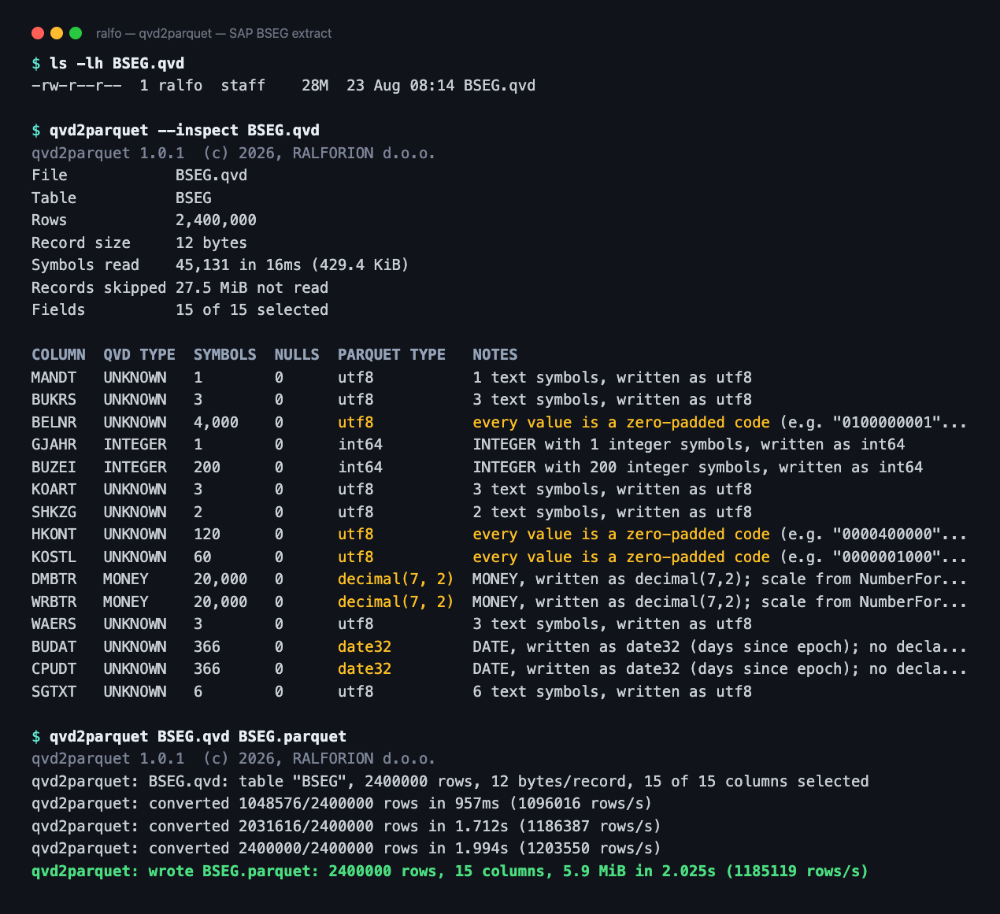

# qvd2parquet

<p>
<a href="https://github.com/ralforion/qvd2parquet/releases/latest"></a>
<a href="https://github.com/ralforion/qvd2parquet/actions/workflows/ci.yml"></a>
<a href="https://pkg.go.dev/github.com/ralforion/qvd2parquet"></a>
<a href="https://go.dev/dl/"></a>
<a href="https://github.com/ralforion/qvd2parquet/blob/main/LICENSE"></a>

</p>

A fast command-line converter from Qlik QVD files to Parquet.

```sh
qvd2parquet input.qvd output.parquet
```

It reads standard, unencrypted QVD files, preserves useful Parquet types
instead of stringifying everything, keeps `MONEY` and `FIX` columns as exact
Parquet decimals, decodes records in parallel, and streams batches into Parquet
row groups so large files never need to be materialized in memory.



Above: 2.4 million rows of an SAP-shaped extract. `--inspect` reports the type
chosen for every column and why, before anything is written. `BELNR`, `HKONT`
and `KOSTL` stay text because their values are zero-padded codes that an
integer would not preserve; `DMBTR` and `WRBTR` become exact decimals rather
than floats; `BUDAT` and `CPUDT` are read as dates although the QVD declares no
type for them. The input is a generated fixture with SAP field names and
shapes, not a real extract.

## Install

See [CHANGELOG.md](CHANGELOG.md) for what changed in each release. From 1.0.0
the CLI surface and the conversion defaults are stable: a flag will not be
removed or change its meaning, and a default will not change what an existing
file converts to, outside a major bump. New behaviour arrives behind a new flag
or a new value for an existing one.

### Prebuilt binaries

Download the archive for your platform from the
[releases page](https://github.com/ralforion/qvd2parquet/releases), unpack it,
and put `qvd2parquet` on your `PATH`. Verify the download against
`SHA256SUMS`:

```sh
shasum -a 256 -c SHA256SUMS --ignore-missing
```

Binaries are pure Go and statically linked (`CGO_ENABLED=0`), so they have no
runtime dependencies. Supported platforms:

| OS | Architectures |
| --- | --- |
| Linux | `amd64`, `arm64` |
| Windows | `amd64`, `arm64` |
| macOS | `amd64` (Intel), `arm64` (Apple silicon) |

Every target is pure Go, so another one is a matter of listing it in
`scripts/build-release.sh` and the two workflow matrices; a test keeps the
three lists identical.

On Windows, run `qvd2parquet.exe` from PowerShell or `cmd`. macOS may quarantine
a downloaded binary; clear it with
`xattr -d com.apple.quarantine qvd2parquet`.

### From source

Requires Go 1.25 or newer. That floor comes from `github.com/apache/arrow-go/v18`;
the `go` directive in `go.mod` is a minimum, not a pin, so the module also
builds with 1.26 and 1.27. CI tests against both the 1.25 floor and the newest
release, and release binaries are built with the newest toolchain.

```sh
go install github.com/ralforion/qvd2parquet/cmd/qvd2parquet@latest
```

or

```sh
go build -o qvd2parquet ./cmd/qvd2parquet
```

### Building all release artifacts

```sh
./scripts/build-release.sh                        # version from git describe
VERSION=v1.2.3 ./scripts/build-release.sh          # explicit version
PLATFORMS="linux/amd64 windows/amd64" ./scripts/build-release.sh
```

This writes `.tar.gz` (Unix) and `.zip` (Windows) archives plus `SHA256SUMS`
into `dist/`. Pushing a `v*` tag runs the same script in CI and publishes a
GitHub release.

## Usage

Options take one dash or two -- `-workers 4` and `--workers 4` are the same
flag, as are `-workers=4` and `--workers=4`. `--help` prints them with one
dash; this README writes two. The one place the form matters is a boolean:
write `--empty-as-null=false`, because `--empty-as-null false` leaves `false`
sitting in the argument list as if it were a file name.

```text
qvd2parquet [options] input.qvd output.parquet
qvd2parquet --inspect [options] input.qvd

  -out-dir DIR               Convert every input into this directory
  -file-workers 1            Files to convert at once; decode workers are divided
  -recursive                 With --out-dir, descend into subdirectories
  -log path.jsonl            Append a JSON Lines record per file
  -columns name1,name2       Convert only these columns
  -exclude '%*,*_TMP'        Skip fields matching these wildcard patterns
  -field-regex <re>          Rewrite field names with this regexp
  -field-name '${name}'      Template for the new column name
  -field-comment '${comment}'  Template for the column comment
  -mixed error               Mixed-type strategy: error|string|promote|dual-columns
  -dual auto                 Dual strategy: auto|numeric|text|columns
  -infer-dates               Read an untyped column as a date/timestamp when its text says so
  -empty-as-null             Write an empty string symbol as null, as Qlik treats it
  -numeric-promote decimal   Numeric widening: decimal | true (float64) | false
  -mixed-string-fallback     Convert otherwise-invalid mixed columns to string
  -decimal-source auto       Decimal extraction: auto|text|numeric
  -decimal-strict            Fail instead of rounding when a value does not fit its scale
  -compression zstd          Parquet compression: zstd|snappy|gzip|uncompressed
  -encoding 'PAT=ENC,...'    Pin column encodings, e.g. '%*_PKEY=delta_byte_array'
  -batch-rows 0              Rows per Arrow batch, 0 sizes it from the column
                             count to hold in-flight memory steady
  -row-group-rows 65536      Rows per Parquet row group
  -workers 0                 Decode workers, 0 means one per 2 CPUs (minimum 2)
  -timezone none             none|Local|UTC|IANA timezone name
  -schema path.json          Explicit schema override
  -schema-report path.json   Write the inferred schema/profile report
  -quality-gate full         Validation mode: none|basic|numeric|full
  -quality-report path.json  Write the post-conversion quality report
  -quality-tolerance 1e-9    Relative tolerance for floating-point quality checks
  -quality-abs-tolerance 0   Absolute tolerance for floating-point quality checks
  -progress 1000000          Log every N rows, 0 disables progress
  -inspect                   Read only the header and symbol tables, print the schema, and exit
  -force                     Overwrite an existing output file
  -strict                    Enable strict validation defaults
  -version                   Print the version and exit
```

### Output

The conversion writes the Parquet file; everything else — the identification
banner, the per-column schema decisions, progress and the final summary — goes
to **stderr**. **stdout stays empty**, so `qvd2parquet` composes safely in
pipelines and shell substitutions.

```text
$ qvd2parquet --timezone UTC --quality-gate numeric sales.qvd sales.parquet
qvd2parquet 2.1.0  (c) 2026, RALFORION d.o.o.
qvd2parquet: sales.qvd: table "products", 77 rows, 7 bytes/record, 9 of 9 columns selected
qvd2parquet: read 412 symbols in 1ms; records start at offset 8973
qvd2parquet: schema: Einkaufspreis: REAL with 75 double symbols promoted to decimal(5,2); scale 2 inferred from values
qvd2parquet: schema: Produktname: 77 text symbols, written as utf8
qvd2parquet: schema: Listenpreis: REAL with 25 integer and 35 double symbols promoted to decimal(5,2); scale 2 inferred from values
qvd2parquet: batch: 65536 rows over 9 columns (~0.6M cells per batch), 65536 rows per row group
qvd2parquet: conversion finished in 2ms: 77 rows (47934 rows/s)
qvd2parquet: quality gate numeric finished in 1ms: passed
qvd2parquet: wrote sales.parquet: 77 rows, 9 columns, 4.6 KiB in 16ms overall (4961 rows/s)
```

`--inspect` reads only the header and symbol tables, so it answers questions
about a large file in seconds rather than minutes. Its table carries each
column's value range rendered in the type the column will be written as, which
is the point of rendering it at all: a QVD stores a date as a serial day
number, so a goods-issue date in the year 3025 arrives as the integer 411241
and sits unremarked among its neighbours.

```text
COLUMN  QVD TYPE  SYMBOLS  NULLS  PARQUET TYPE    RANGE
WADAT   DATE      2071     0      date32          2005-01-13 .. 3025-12-08
BUDAT   DATE      2020     0      date32          2019-12-27 .. 2026-08-31
VV120   REAL      179590   0      decimal(12, 2)  -8115022364.86 .. 8115022364.86
KNDNR   ASCII     27767    0      utf8
```

Read against `BUDAT`, the `WADAT` range is obviously wrong. Text columns have
no range worth printing and show none.

A decimal's precision is inferred from the values it holds, so it fits them
exactly by construction and never overflows the data it was built from. What
varies is how much room is left for a later load, and that is reported
separately:

```text
Decimal columns with little room left for larger values:
  VV120 (decimal(12, 2), 81% used)
Pin them with --schema if a later load may exceed the range.
```

`--schema-report` carries the same range per column as JSON, alongside the
decimal's `limit` and `usedFraction`. The `--log` record does not: it is one
line per file and stays that way, so it carries only `decimalsNearLimit`, the
names a scheduled run would want to alert on.

One `schema:` line is printed per output column, explaining exactly why each
type was chosen. That is the first thing to read when a mixed-type column
fails; `--schema-report` writes the same reasoning as JSON.

Each phase reports its own duration, so a slow run can be attributed without
guessing: the conversion and the quality gate time themselves separately, and
the final line is the whole run, not just the write. On a wide file the gate is
routinely the larger half. Those two lines are printed whatever `--progress` is
set to; `--progress` only controls the running `converted N/M rows` and
`verified N/M rows` lines in between.

Those running lines carry the share done and an estimate of the time left:

```text
qvd2parquet: converted 5000000/20589661 rows (24%) in 3m21s (24875 rows/s, about 10m26s left)
```

The row total comes from the QVD header before a single record is decoded, so
both are arithmetic on numbers the run already has. The throughput shown is the
average since the phase started; the estimate is not, it follows the recent
rate, so the two can disagree while a run is speeding up. That is deliberate: a
run carries the cost of starting up in its average long after it has found its
speed, and projecting from the average stays pessimistic for the rest of the
file. The quality gate has its own total and its own speed, so it projects
separately rather than continuing the conversion's estimate.

Everything goes to stderr, so `2> run.log` captures it all and leaves stdout
empty.

Print the version and exit with `--version`:

```text
$ qvd2parquet --version
qvd2parquet 2.1.0  (c) 2026, RALFORION d.o.o.
```

### Examples

Convert with reproducible timestamps and validated numerics:

```sh
qvd2parquet --timezone UTC --quality-gate numeric --quality-report out.quality.json \
  sales.qvd sales.parquet
```

Convert a subset of a very large QVD with bounded memory:

```sh
qvd2parquet --columns CustomerID,OrderDate,Amount --batch-rows 16384 --workers 4 \
  orders.qvd orders.parquet
```

Strip QlikView's internal key fields and shorten composite SAP field names,
keeping the description as a column comment:

```sh
qvd2parquet \
  --exclude '%*' \
  --field-regex '^[^-]*-\|\|-(?P<name>[^-]*)-\|\|-(?P<comment>.*)$' \
  A057.qvd a057.parquet
```

Understand why a column resolved the way it did:

```sh
qvd2parquet --schema-report schema.json sales.qvd sales.parquet
```

Verify the output with an external reader:

```sh
duckdb -c "describe select * from read_parquet('sales.parquet')"
duckdb -c "select count(*) as n from read_parquet('sales.parquet')"
```

## Converting a folder

Pass `--out-dir` with one or more files or directories. Each `.qvd` becomes a
`.parquet` of the same name:

```sh
qvd2parquet --out-dir ./parquet --quality-gate numeric --log run.jsonl ./qvds
```

```text
qvd2parquet: converting 4 file(s)
qvd2parquet: ok   qvds/products.qvd -> parquet/products.parquet (77 rows, 9 columns, 4.6 KiB)
qvd2parquet: ok   qvds/sales.qvd -> parquet/sales.parquet (1,000 rows, 7 columns, 7.7 KiB)
qvd2parquet: FAIL qvds/truncated.qvd: no XML header terminator (0x00) found: not a QVD file?
qvd2parquet: ok   qvds/stock.qvd -> parquet/stock.parquet (120 rows, 19 columns, 7.3 KiB)
converted 3/4 file(s) in 34ms: 1,197 rows, 19.6 KiB

FAILED (1):
  qvds/truncated.qvd           no XML header terminator (0x00) found: not a QVD file?
```

**A failing file does not stop the run.** Every input is attempted — including
a path that does not exist, which is reported as a failed file rather than
aborting the inputs beside it. Failures are listed at the end, and the exit
code reports the most actionable one — a schema
policy error you can fix outranks a generic read error. Add `--recursive` to
descend into subdirectories.

Two inputs whose names would produce the same output file are refused **before
anything is written**, since `--force` would otherwise silently overwrite the
first result.

### Parallelism

Each decode worker reads its chunks through its own handle on the input. That
matters on Windows, where concurrent `ReadAt` on a single file handle is
serialized by the runtime -- it takes the descriptor's read and write locks and
moves its shared file pointer -- so one handle would put every worker behind a
single mutex.

`--file-workers` converts several files at once and **divides the decode
workers between them**, so the total stays near the default worker count:

```text
$ qvd2parquet --out-dir out --file-workers 4 ./qvds
qvd2parquet: converting 50 file(s), 4 at a time, 2 decode worker(s) each
```

Each file reports its own progress. Converting several at once, every line
names the file it belongs to:

```text
qvd2parquet: qvds/CE10500.qvd: converted 1000000/20589661 rows (5%) in 43.493s (23099 rows/s, about 14m11s left)
qvd2parquet: qvds/BSEG.qvd: converted 1000000/8402113 rows (12%) in 41.882s (23876 rows/s, about 5m10s left)
```

Converting one at a time, nothing can interleave and the prefix is left off.

The default is `1`: one file at a time, decoding it with the default worker
count. Raise it for many small files, where per-file parallelism beats
per-chunk. This is the main reason folder conversion is built in rather than
left to a shell loop — four separate processes would each start their own full
set of workers, oversubscribing the machine fourfold.

The budget being divided is the automatic worker count, not one per CPU, which
is why four files at a time on a 16-CPU machine get two workers each. Raise
`--workers` alongside `--file-workers` when the machine has headroom for more:
`--file-workers 4 --workers 16` gives four each.

### The log

`--log` writes JSON Lines: one record per file, then a summary. That format is
chosen so a finished run can be queried rather than read:

```sh
duckdb -c "select status, count(*), sum(rows) from read_json_auto('run.jsonl')
           where type='file' group by 1"
duckdb -c "select input, error from read_json_auto('run.jsonl') where status='failed'"
```

Each file record carries the row and column counts, output size, elapsed time,
throughput, `excludeNoMatch` with any pattern that dropped nothing from that
file, `fieldsRenamed` and `fieldsUnchanged`, and the quality gate's verdict with
any errors — so a batch can be
audited without opening every per-file report. `--schema-report` and
`--quality-report` also work in batch mode; each file gets its own document,
named after the input.

## Inspecting a file

`--inspect` reads the XML header and the symbol tables, prints the schema a
conversion would produce, and exits. It never touches the record area, so the
cost is independent of row count — on a 29 MiB, 5-million-row file it reads
7.9 KiB and finishes in 0.01s, against 1.58s for the full conversion.

```sh
qvd2parquet --inspect products.qvd
```

```text
File            products.qvd
Table           products
Rows            77
Record size     7 bytes
Symbols read    412 in 2ms (3.2 KiB)
Records skipped 539 B not read
Fields          9 of 9 selected

COLUMN           QVD TYPE  SYMBOLS  NULLS  PARQUET TYPE   NOTES
Einkaufspreis    REAL      75       0      decimal(5, 2)  REAL with 75 double symbols promoted to decimal(5,2); scale 2 inferred from values
KategorieNr      INTEGER   8        0      int64          INTEGER with 8 integer symbols, written as int64
Produktname      UNKNOWN   77       0      utf8           77 text symbols, written as utf8
Listenpreis      REAL      60       0      decimal(5, 2)  REAL with 25 integer and 35 double symbols promoted to decimal(5,2); scale 2 inferred from values
```

The report is written to **stdout**, so it can be piped; the banner and any
diagnostics stay on stderr. All type policy flags apply, so what you see is what
a conversion would write — including `--exclude` and `--field-regex`:

```sh
qvd2parquet --inspect \
  --exclude '%*,COUNTER' \
  --field-regex '^[^-]*-\|\|-(?P<name>[^-]*)-\|\|-(?P<comment>.*)$' \
  A057.qvd
```

```text
Fields          3 of 5 selected (2 excluded: %A057_PKEY, %SYS_TS)
Exclude         "COUNTER" matched no field
Field regex     2 of 3 field(s) renamed, 1 unchanged: PlainField

COLUMN                                    QVD TYPE  SYMBOLS  NULLS  PARQUET TYPE  RANGE           NOTES
DATBI (A057-||-DATBI-||-Ende Gültigkeit)  INTEGER   2        0      int64         45000 .. 45001  Ende Gültigkeit
KSCHL (A057-||-KSCHL-||-Konditionsart)    ASCII     2        0      utf8                          Konditionsart
PlainField                                ASCII     2        0      utf8                          2 text symbols, written as utf8
```

The two middle lines appear only when there is something to say. A pattern that
matched no field and a field the expression left alone are both invisible in the
conversion itself, and both are usually a mistake worth catching before a run
that lasts a quarter of an hour.

When the type policy rejects a column, `--inspect` prints the reason and falls
back to the raw symbol profiles that explain it, then exits `3`:

```text
Schema could not be resolved:
  schema/type policy error: mixed type column "CustomerID": symbols contain 1 numeric values and 1 strings; use --mixed=string ...

COLUMN      QVD TYPE  SYMBOLS  NULLS  INTS  FLOATS  STRINGS  DUALS
CustomerID  ASCII     2        0      1     0       1        0
```

That makes it a cheap pre-flight check in a pipeline: inspect first, and only
convert once the schema is what you expect. `--schema-report` works in inspect
mode too, for the same information as JSON.

## Column encodings

Every column is written with a dictionary by default, which is right for the
columns a QVD is usually full of: a field with twenty-seven thousand distinct
values across twenty million rows costs almost nothing that way.

It is worth nothing on a column whose values are nearly all distinct. The
dictionary page overflows, the writer falls back to `PLAIN`, and the column
ends up as raw bytes with only the compressor working on it. A Qlik composite
primary key is exactly that column: one distinct value per row.

`--encoding` pins such a column to something better:

```sh
qvd2parquet --encoding '%*_PKEY=delta_byte_array' CE10500.qvd ce10500.parquet
```

```text
qvd2parquet: encoding: %CE10500_PKEY=delta_byte_array
```

Patterns are wildcards, matched against **both** the output column name and the
original QVD name, so one rule covers a folder of SAP tables whose keys are
named per table. A later rule wins over an earlier one, so `'*=plain,KEY=delta_byte_array'`
sets a default and an exception. A pattern that matches no column is reported
rather than rejected, for the same reason `--exclude` does that: one command
line is often pointed at tables that do not all carry the same fields.

The encodings on offer, and what they suit:

| encoding | for |
|---|---|
| `dictionary` | the default: repeated values of any type |
| `plain` | values with no structure to exploit |
| `delta_byte_array` | text whose consecutive rows share a prefix, such as a sorted composite key |
| `delta_length_byte_array` | text of varying length with no shared prefix |
| `delta_binary_packed` | integers, dates and timestamps that move in small steps |

An encoding the column's type cannot carry is refused before the conversion
starts, naming the ones that fit. Pinning a column also turns its dictionary
off, since leaving it on would mean the pinned encoding took over only once the
dictionary page overflowed.

Whether `delta_byte_array` pays depends on the order the rows arrive in, since
it stores each value against the one before it. On a key that arrives in
document order it can cut the column to a third; on the same values shuffled it
saves almost nothing. Measure before adopting it: convert once with and once
without, and compare.

## Selecting and renaming fields

`--columns` keeps only the named fields. `--exclude` drops fields matching
shell-style wildcard patterns (`*` and `?`, case-insensitive), which is the
usual way to strip QlikView's internal key fields from a SAP extract:

```sh
qvd2parquet --exclude '%*' A057.qvd a057.parquet
```

Patterns match the field's **original** QVD name, before any renaming, so they
describe what you see in the source file. Excluding every column is an error.

A pattern that matches nothing is **not** an error, since one command line is
often pointed at a folder of tables that do not all carry the same fields, but
it is reported:

```text
qvd2parquet: note: --exclude "%" matched no field; patterns are wildcards over
the original QVD names, before --field-regex renames anything
```

Both ways of getting a pattern wrong look exactly like success otherwise. `%`
is not the wildcard `%*` and matches only a field named `%`, and a name that
`--field-regex` produces is never what `--exclude` sees.

QVD field names from SAP extracts are often composite, packing the table, the
technical name and a description into one string:

```text
A057-||-DATBI-||-Ende Gültigkeit
```

`--field-regex` rewrites them. Name the capture groups `name` and `comment` and
no other flag is needed:

```sh
qvd2parquet \
  --exclude '%*' \
  --field-regex '^[^-]*-\|\|-(?P<name>[^-]*)-\|\|-(?P<comment>.*)$' \
  A057.qvd a057.parquet
```

```text
qvd2parquet: excluded 2 column(s) by pattern: %A057_PKEY, %SYS_TS
qvd2parquet: schema: A057-||-DATBI-||-Ende Gültigkeit: INTEGER with 2 integer symbols, written as int64; written as "DATBI" with comment "Ende Gültigkeit"
qvd2parquet: schema: A057-||-KBETR-||-Betrag: REAL with 2 double symbols promoted to decimal(4,2); scale 2 inferred from values; written as "KBETR" with comment "Betrag"
qvd2parquet: field-regex: 2 of 3 field(s) renamed, 1 unchanged: PlainField
```

A field the expression does not match keeps its original name, which is what
makes a rule aimed at a subset possible. The closing line says which fields
those were, because on a 213 column extract nobody spots the two that stayed
behind. At most five are named; `--schema-report` carries the full list under
`fieldRegex`, and a `--log` record carries the counts.

The result carries the description as Parquet field metadata, and keeps the
original QVD name so nothing is lost:

```text
DATBI  int64             {"comment": "Ende Gültigkeit", "qvd.field": "A057-||-DATBI-||-Ende Gültigkeit"}
KSCHL  string            {"comment": "Konditionsart",   "qvd.field": "A057-||-KSCHL-||-Konditionsart"}
KBETR  decimal128(4, 2)  {"comment": "Betrag",          "qvd.field": "A057-||-KBETR-||-Betrag"}
```

Rules worth knowing:

- A field the expression does not match keeps its original name and gets no
  comment, so one rule can target a subset of the fields.
- `--field-name` and `--field-comment` accept Go regexp templates (`$1`,
  `${name}`) when named groups are not enough, e.g. `--field-name '${1}_${2}'`.
- Two fields that collapse to the same output name are rejected as a schema
  policy error rather than producing a duplicate Parquet column.
- A regex with no `name` group and no explicit `--field-name` is rejected up
  front, since it would blank every column name.

## Exit codes

| Code | Meaning |
| --- | --- |
| 0 | success |
| 1 | CLI usage error |
| 2 | unsupported QVD feature |
| 3 | schema/type policy error |
| 4 | input read/decode error |
| 5 | output/write error |
| 6 | quality gate failure |
| 7 | cancelled by Ctrl-C or SIGTERM |

## Type resolution

The Parquet schema is resolved only after every selected column's symbol table
has been read and profiled. That makes mixed-type behaviour explicit instead of
producing an unstable schema that depends on which rows were seen first.

| QVD field | Parquet / Arrow type |
| --- | --- |
| `INTEGER` with integer symbols | `int64` |
| `REAL` with double symbols | `decimal128(p, s)`, scale inferred from the values; `float64` if no exact scale exists |
| `MONEY`, `FIX` | `decimal128(p, s)` — never `float64` |
| `DATE` | `date32` (days since the Unix epoch) |
| `TIMESTAMP` | `timestamp[us]`, or `timestamp[us, tz=UTC]` when `--timezone` names a zone |
| `TIME` | `time32[ms]` (milliseconds since midnight) |
| `ASCII` or text-only symbols | `utf8` |
| all-null column | nullable `utf8` |

Every output column is nullable.

### What becomes null

- A record whose biased symbol index is negative. This is how QVD encodes a
  missing value, and it is by far the common case.
- A symbol carrying the `0x00` tag.
- An empty string symbol, since Qlik treats it as absent. Pass
  `--empty-as-null=false` to keep `""` distinct from null.
- A NaN or infinite value in a column whose type cannot represent one — date,
  timestamp, time, integer or decimal. A `float64` column keeps them. This is
  defensive: no QVD written by QlikView has been observed to store NaN, but a
  file produced by another writer might.

Each substitution beyond the first two is counted and reported on stderr, so
none of them is silent. A *finite* value that simply does not fit its column is
an error rather than a null, because discarding real data silently is the one
thing the converter should not do.

### Mixed-type columns

A QVD column can hold several symbol encodings at once. Some combinations are
harmless, some are not:

- `int + null`, `float + null` — fine.
- `int + float` — resolved to an exact decimal by default
  (`--numeric-promote=decimal`), or widened to `float64` with
  `--numeric-promote=true`.
- dual numeric + display string — a normal Qlik concept, resolved by `--dual`.
- number + unrelated text — never silently made numeric.

One shape of the last case resolves on its own, because nothing is actually
being decided: when the numeric symbols are **integers** and **every symbol in
the column carries its own display string**, the file already states the text
for every value, so the column is written as `utf8` without inventing a
rendering for anything. The LEGO `parts.qvd` is the archetype -- `part_num`
holds `0901` beside the number 901, and `0687b1` beside nothing at all. `0901`
is a code, not a quantity, and reading it as 901 would not survive a round trip.

The rule stops there. A **decimal** beside text is more likely a measurement
whose display string is a formatting of it, and a bare number carries no text to
reuse, so both still fail and leave the call to you.

`--mixed` selects what happens to everything else:

| Value | Behaviour |
| --- | --- |
| `error` (default) | fail with the counts of each symbol kind and the flag that would fix it |
| `string` | write the whole column as UTF-8; the display string wins for duals |
| `promote` | keep numerics numeric and pure text as text; still fail on number + text unless `--mixed-string-fallback` |
| `dual-columns` | write the numeric side under the original name and the display side as `${name}__text` |

A column whose values are integers stored beside their own zero-padded digits
is written as `utf8` under `--dual=auto`. The padding is part of the value: SAP keeps its keys as
fixed-width codes -- `BELNR` is `CHAR(10)`, so document 100000001 is stored
`0100000001` -- and reading that as 100000001 produces a key that no longer
joins back. Padded decimals are formatting rather than codes, and dates are
neither, so both keep their own typing. Naming a side with `--dual` overrides
the inference: `--dual=numeric` still writes the number, padding and all lost.

An untyped column whose display strings render its serial as a date or
timestamp is read as one, so it arrives typed rather than as a bare serial with
a `__text` sidecar. Two things bound that: a symbol carrying no value is
skipped, since a null placeholder says nothing about the rest of the column, and
the serial has to fall between 1600 and 2200. The window reaches back that far
because historical series are real -- the Stockholm temperature record starts in
1756. It is a sanity check rather than the real filter: the display string still
has to render that particular serial, which is why a month number beside `Jan`
is not a date and keeps both columns.

`--dual` selects which side of a Qlik dual is written:

| Value | Behaviour |
| --- | --- |
| `auto` (default) | keep the display string only when it carries something the number does not |
| `numeric` | write the numeric side only |
| `text` | write the display string only |
| `columns` | always write both |

`--mixed=dual-columns` implies `--dual=columns`.

### What `--dual=auto` considers redundant

A Qlik dual pairs a number with a display string. Often that string is just the
number formatted — `1.234,56` beside `1234.56`, or `11/20/2010` beside the
Excel-style serial `40502`. Writing it would duplicate the numeric column, so
`auto` drops it. When the string carries something else — `Open` beside `1`, or
`unknown` beside `-1` — it is kept as `${name}__text` and the reason is stated:

```text
schema: Amount: MONEY, written as decimal(6,2); ...; all 3 display strings are formatted renderings of the numeric value, so no text column is written
schema: Status: INTEGER with 3 integer symbols, written as int64; 3 of 3 display strings carry text the number does not (e.g. "Open" beside 1), so they are kept in "Status__text"
```

A single odd value is enough to keep the column: `auto` errs towards preserving
data, and reports how many strings drove the decision.

Whether a rendered date counts as redundant depends on the type it sits beside.
`11/20/2010` next to a `date32` column adds nothing, but next to a bare
`float64` serial it is the only human-readable form, so it is kept.

### Identifying dates without a declared type

Qlik writes semantic tags alongside each field. A field declaring no
`NumberFormat/Type` but tagged `$date`, `$timestamp`, `$time` or `$interval` is
resolved to that type:

```text
schema: OrderDate: DATE, written as date32 (days since epoch); no declared type, but tagged $date
schema: Created: TIMESTAMP, written as timestamp[us]; no declared type, but tagged $timestamp
```

This is the most reliable signal, and the only one that works for a **plain
numeric field carrying no display strings** — a bare Excel serial that no
amount of text inspection could identify. A declared type still wins over a
tag, since it is the more specific statement.

### Inferring dates from display strings

Older files carry no tags at all. `--infer-dates` (on by default) is the
fallback: a column with no declared type is read as a date or timestamp when
**every** display string renders its Excel-style serial value as one:

```text
schema: Date: TIMESTAMP, written as timestamp[us]; no declared type, but all 18 display strings render their value as a timestamp (e.g. "11/20/2010"), so it is read as one
```

The check is format-agnostic: it converts the serial to a date and requires
every number in the string to be one of that date's components, with the day
itself present. A neighbouring day is accepted, because the string was rendered
in whatever timezone wrote the file and a whole-hour offset can move the
calendar date — real QVDs contain exactly this. Serials outside roughly 1900 to
2200 are never read as dates, blank display strings are not evidence, and a
column mixing dates with anything else is left alone. Pass `--infer-dates=false`
to disable it.

Output column names must be unique. If a generated `${name}__text` column would
collide with a real source column of that name, the conversion fails with a
schema policy error rather than writing an ambiguous Parquet schema.

The defaults — `--mixed=error --numeric-promote=decimal --dual=auto
--mixed-string-fallback=false` — stop an ETL job on unexpected schema drift
while still handling the common `int + float` and dual-numeric cases.

### Numeric widening

`--numeric-promote` controls how a numeric column that is **not** already a
declared `MONEY`/`FIX` is widened:

| Value | Behaviour |
| --- | --- |
| `decimal` (default) | resolve any column carrying fractional values to an exact decimal |
| `true` | widen `int + float` to `float64` |
| `false` | refuse to widen; a mixed numeric column is a policy error |

`--numeric-promote=decimal` exists because QlikView often declares a price as
plain `REAL`. In that case the header carries no usable scale — `nDec` holds a
filler value (commonly 14) and the display format has no decimal separator — so
the scale is derived from the values themselves: the smallest scale at which
every value is exactly representable, up to 9 decimals.

```text
$ qvd2parquet products.qvd out.parquet          # decimal is the default
qvd2parquet: schema: Einkaufspreis: REAL with 75 double symbols promoted to decimal(5,2); scale 2 inferred from values
qvd2parquet: schema: Listenpreis: REAL with 25 integer and 35 double symbols promoted to decimal(5,2); scale 2 inferred from values
qvd2parquet: schema: MengeAufLager: INTEGER with 51 integer symbols, written as int64
```

Pure-integer columns are left as `int64`, since `decimal(p,0)` would gain
nothing, and a declared `MONEY`/`FIX` keeps using its own `nDec` rather than a
value-inferred scale.

If no scale within 9 decimals represents every value, the column really is
floating point and is written as `float64`. That fallback is silent by default,
because the default is a preference rather than a demand and `float64` is what
the column would have resolved to anyway. Passing `--numeric-promote=decimal`
explicitly turns it into a demand: the conversion then fails with a schema
policy error naming the column, so you can pin it with `--schema`.

**Caveat worth knowing.** An inferred scale describes the data actually
present, so a later extract containing a value with more decimals can resolve
the same column to a different scale. For a pipeline that must produce a
stable schema across runs, pin the column instead:

```json
{ "columns": { "Listenpreis": { "type": "decimal", "precision": 18, "scale": 2 } } }
```

### Exact decimals

`MONEY` and `FIX` are always written as Parquet decimals. Values are carried as
scaled integers end to end, so no step of the pipeline rounds through a double.

- Scale comes from `NumberFormat/nDec`, or is inferred from display strings when
  `nDec` is absent. If neither is available the conversion fails and asks for a
  `--schema` override.
- Precision is inferred from the scaled values actually present, sign excluded.
  Exceeding decimal128's 38 digits fails with a clear message.
- `--decimal-source=auto` (the default) prefers the dual display string, which
  preserves decimal intent better than the binary double, and falls back to
  scaling the numeric payload. `text` and `numeric` force one source.
- By default a value that does not fit the declared scale is **rounded** to it,
  half away from zero — the same value Qlik itself displays for a field with
  `nDec` decimals. Rounding is counted and reported, both on stderr and in
  `--schema-report`, so it is never silent:

  ```text
  qvd2parquet: schema: Amount: MONEY, written as decimal(9,2); ...; 3 value(s) rounded to scale 2 (--decimal-strict=false)
  qvd2parquet: note: 3 decimal value(s) were rounded to their column's scale; pass --decimal-strict to fail instead
  ```

- `--decimal-strict` restores the stricter behaviour: the conversion fails
  naming the column and the offending value. Use it in a pipeline where an
  unexpected precision change must stop the job. `--strict` implies it.
- A value is never dropped. Turning an inexact value into a null would lose
  data that no later check could recover, since the quality metrics describe
  the converted value.

The schema report records the resolved precision and scale and whether the
digits came from display strings, numeric payloads, or both.

### Schema overrides

```json
{
  "columns": {
    "Amount": { "type": "decimal", "precision": 18, "scale": 4 },
    "CustomerID": { "type": "string" }
  }
}
```

Supported types: `string`, `int64`, `float64`, `date32`, `timestamp`, `time`,
`decimal`. Overrides are validated against the actual symbols before anything is
written, so pinning a column holding doubles to `int64`, or a text column to
`date32`, fails as a schema policy error (exit code 3) rather than silently
truncating or failing part-way through the conversion.

A pinned `timestamp` is converted with the run's `--timezone` and typed like
any other timestamp: `timestamp[us]` by default, `timestamp[us, tz=UTC]` when a
zone is named. It reports the same conversion caveats too, so a pin that
relocates a wall clock across a DST discontinuity says so rather than doing it
quietly.

### Dates and times

Qlik stores dates and times as serial day numbers where `25569` is
1970-01-01. A serial names no timezone: it is a bare wall-clock reading, and
Qlik's own display string for a dual is a pure formatting of the same number
with no zone step. Which zone that wall clock was recorded in is simply not in
the file.

`--timezone` therefore does not change the wall clock -- every mode writes back
the same calendar and clock fields, with one exception noted below. What it
decides is which *instant* those fields denote, and so which number lands in
the file:

- `none` (default) writes the wall clock as-is, with no timezone on the column
  (Parquet `isAdjustedToUTC=false`). It asserts nothing the QVD does not say,
  and the output is byte-identical whatever machine converts it. Nothing is
  converted unless you ask for it.
- Any IANA name (`Europe/Berlin`) asserts that the wall clocks were recorded in
  that zone and converts them to true instants. This is the mode that earns its
  keep for Parquet: the instant is what makes ordering across a DST change,
  joins against other instant data, and rendering in a consumer's own zone come
  out right. Losing the *name* costs nothing, since an instant is unambiguous
  without it.
- `UTC` is the same assertion for UTC. It stores the identical bytes as `none`
  and differs only in claiming instant semantics.
- `Local` is `UTC`'s assertion made with whatever zone the converting machine
  happens to be in, and matches the Java reference reader. It is the one mode
  whose output depends on where it ran, so it is no longer the default.

The exception is a DST discontinuity. A zoned mode has to place the wall clock
on the timeline, and twice a year some wall clocks do not sit there cleanly:
`2023-03-26 02:30` never happens in `Europe/Berlin`, so it is written as
`03:30`, and `2023-10-29 02:30` happens twice, so one of the two instants is
picked. `none` has no such edge, because it never places the reading on a
timeline at all.

Both sides of that discontinuity turn up in real data, so both matter.

Timestamps recorded by a device following the local clock skip the missing
hour. The Chicago taxi QVDs show it: on 13 March 2016 the data runs 01:45, then
03:00, with the 02:00 hour absent because the local clock skipped it.

    01:45   1035 trips
    03:00   1049 trips

That also settles what those values are -- local readings, not UTC, since a UTC
series would have no gap.

Plenty of local-time data does contain the missing hour, though. Generated
master calendars enumerate every slot whether the zone had it or not, scheduled
and derived timestamps are computed in local terms, and extracts from systems
that do not observe DST write wall clocks the target zone never had. A zoned
conversion silently relocates every one of those, and an ambiguous reading from
the repeated hour is resolved by picking one of the two instants.

That is the argument for `none` being the safe choice. Converting these
readings to instants is only correct with the zone the source actually used --
`America/Chicago` for the taxi data, which nothing in the QVD says, and whose
offset is not even constant across a single file. Choosing a zone is a claim
about provenance that only the person running the conversion can make, and
`Local` makes it accidentally, using whatever zone the converting machine sits
in.

`--timezone` names the zone the *input* wall clocks were recorded in. It is not
a label for the output: every mode but `none` writes `tz=UTC`, because once the
readings are on the timeline what is stored is a UTC instant.

    --timezone=none              timestamp[us]            2016-03-01 00:00:00
    --timezone=UTC               timestamp[us, tz=UTC]    2016-03-01 00:00:00Z
    --timezone=America/Chicago   timestamp[us, tz=UTC]    2016-03-01 06:00:00Z
    --timezone=Asia/Tokyo        timestamp[us, tz=UTC]    2016-02-29 15:00:00Z

Stamping the source zone instead would split the readership. Parquet cannot
record a timezone *name* at all -- its timestamp type carries only
`isAdjustedToUTC` plus the unit -- so a name survives solely in Arrow's
`ARROW:schema` metadata. pyarrow and polars would recover it and render the
values back in the source zone, while DuckDB, Spark, Trino and Dremio, which
see the Parquet type alone, would render the instant. Identical bytes would
show two different times, and the Arrow rendering would look as though no
conversion had happened. Naming UTC keeps every reader agreeing.

Engines differ in what they do with `isAdjustedToUTC`, so it is worth knowing
your target. Measured against `dremio/dremio-oss` with both files loaded from
S3, Dremio renders the stored value verbatim and never shifts it:

    ts_naive     (isAdjustedToUTC=false)   TIMESTAMP   2023-03-15 00:00:00.000
    ts_chicago   (isAdjustedToUTC=true)    TIMESTAMP   2023-03-15 05:00:00.000

Both arrive as a plain `TIMESTAMP`, and the same two files render identically
on a Dremio whose host clock is `Asia/Tokyo` -- its `CURRENT_TIMESTAMP` stays
UTC regardless. So Dremio applies no session zone in either direction, which
makes both modes stable there, unlike DuckDB, which re-renders an instant in
whatever zone the session is set to. The flip side is that Dremio shows no
difference between the two: a wall clock and a UTC instant are the same type on
arrival, so which one a column holds has to be conveyed by naming or
documentation rather than by the schema.

The source zone is therefore not preserved anywhere in the file. It is an input
to the conversion, not part of the result; record it in a column comment with
`--field-comment` if the provenance matters downstream.

Timestamps are written as `timestamp[us]`. Microseconds are the finest unit a
Qlik serial carries any signal in: one float64 ulp is about 0.63us at
present-day serials. Rounding there removes the encoding noise — measured at up
to 210ns on real Qlik output, which is what makes a stored `07:15:00` read back
elsewhere as `07:14:59.999999` — without discarding anything the source could
have expressed.

`date32` and `time32[ms]` are timezone independent.

## Parallel decoding

The record area is fixed-width, so once the symbol tables are read it can be
split into contiguous row ranges and decoded concurrently. Each worker owns its
Arrow builders, reads its byte range with `ReadAt`, and emits one Arrow record
plus chunk-local quality metrics. A single writer goroutine feeds the Parquet
writer, which is not safe for concurrent use.

**Row order is preserved.** Decoding runs in parallel, but records reach the
writer in chunk order, so the Parquet file holds the QVD's rows in their
original order regardless of worker count. The output is byte-comparable across
worker counts, and row groups hold contiguous ranges of source rows.

That last part is what makes row-group statistics useful. A row group's
per-column min/max only bound the rows it actually holds if those rows are
contiguous in the source; when they are not, an engine doing row-group skipping
over a sorted key cannot rule the group out. On a 500k-row fixture keyed by an
ascending `DocNo`, the spans covered by the row groups summed to exactly 1.0x
the row count, against 3.1x and 3.8x on two runs before records were ordered.

A chunk that finishes ahead of its predecessors waits in a small reorder
buffer. The feeder issues at most two chunks per worker before waiting for one
to be written, which bounds that buffer and is why a slow chunk cannot pull an
unbounded number of finished records into memory behind it. Every quality
metric is order-independent regardless, so validation is unaffected either way.

On a failure the context is cancelled, in-flight chunks are drained, and the
temporary output is removed.

### Cancelling a run

Ctrl-C (or `SIGTERM`) stops the conversion at the next chunk boundary and the
quality gate at the next batch, drains what is in flight, removes the temporary
output, and exits **7**.

Nothing is left behind. The partial Parquet file is deleted, and an existing
file at the output path is untouched — including under `--force`, which
licenses replacing that file only on success, since the rename happens last.
If the temporary file cannot be deleted, the run says so and names it, rather
than leaving an unfinished Parquet file next to the real one with nothing but
its `.tmp-` suffix to mark it. Removal is retried briefly first, because
Windows refuses to delete a file while any handle is open and a virus scanner
or the search indexer routinely holds one for a moment on a file just written.

Cancelling is reported as cancellation, not as bad data. A stopped run has
written fewer rows than the header declares, which is indistinguishable from a
truncated input if you only look at the counts, and a stopped gate has verified
only part of the file. Neither is an `input error` or a `quality gate failure`,
and neither exits 4 or 6.

The first signal is graceful; a second one terminates immediately. That matters
on a wide file, where the gate can run for minutes after the last `converted`
line:

```text
qvd2parquet: cancelling, finishing the current step; press Ctrl-C again to stop now
qvd2parquet: canceled after 234725 of 1000000 rows
```

## Quality gate

`--quality-gate` validates the written Parquet file against metrics collected
from the values the converter actually produced. Validation always reads the
temporary file *before* the final rename, so a failed gate never leaves a
final-looking output behind.

| Mode | What it checks |
| --- | --- |
| `none` | nothing |
| `basic` | the file opens; row count, column names, and types match the resolved schema; per-column null counts match |
| `numeric` | everything in `basic` plus sum, min, max (and sum of squares for floats) per numeric, decimal, date, timestamp and time column |
| `full` (default) | everything in `numeric` plus order-independent `sha256` value fingerprints per column |

Integer, decimal and date/time aggregates are compared exactly — decimal sums
use scaled-integer arithmetic, with no floating-point tolerance. Floating-point
sums use both tolerances:

```text
abs(a-b) <= absTolerance || abs(a-b) <= relTolerance * max(abs(a), abs(b), 1)
```

`full` mode builds a multiset fingerprint (row count, XOR of digests, and a
modular sum of digests) rather than an ordered stream hash, so it is valid
despite unordered chunk delivery. Nulls are marked explicitly in the digest, so
a null never collides with a zero or an empty string.

`--decimal-strict` fails instead of rounding, and reports up to three offending
values per column with the total:

```text
column "VV120" has 5 such value(s), the first 3 shown
    symbol 0 (float 8115022364.865): stored as 8115022364.864999771, not a multiple of 0.001
    symbol 1 (float 7115022364.865): stored as 7115022364.864999771, not a multiple of 0.001
    symbol 2 (float 6115022364.865): stored as 6115022364.864999771, not a multiple of 0.001
```

Each value is shown twice on purpose: as its shortest form, and as the double
actually holds it. A value reading `8115022364.865` that is stored as
`8115022364.864999771` is float64 representation error, and rounding it to the
column's scale is more faithful than keeping it. One reading `1234.565` stored
as `1234.565000000` is a genuine third decimal, and the column wants pinning
with `--schema`. Pair it with `--inspect` to get the answer without converting.

`--quality-report` is written on success and on failure.

The gate defaults to `full`: a conversion nobody checked is not a conversion
anybody can trust, and the fingerprints are what catch a value that survived
the type policy but not the round trip.

It is not free, and it costs in two places rather than one. The read-back pass
is the visible half: the whole output is read again and every cell digested,
split across `--workers` by row group. The other half is inside the conversion
— `full` is the only mode that fingerprints values, so each decode worker
digests every value as it writes it. On a 213-column fixture, holding everything else equal and changing
only the mode, conversion ran at 106k rows/s under `none`, 114k under `numeric`
and 62k under `full`: the inline digest costs about 40% of decode throughput,
while `basic` and `numeric` cost nothing there, collecting their metrics from
values already being converted.

When that is too much for a run, name a cheaper mode explicitly:

```sh
--quality-gate=numeric --quality-report out.quality.json
```

`--quality-gate=none` skips validation entirely. Prefer `basic` over `none` if
throughput matters: it still catches a truncated or mistyped output, and costs
a fraction of `full`.

## Performance

Measured on an Apple M3 Max (16 cores) over a 200k-row synthetic fixture with
integer, high-cardinality string, decimal, date and nullable double columns.

Decode only (no Parquet writing), the fixture split into ~98 chunks:

| Workers | Rows/s |
| --- | --- |
| 1 | 4.6M |
| 2 | 8.3M |
| 4 | 13.6M |
| 8 | 18.8M |
| `--workers=0` default, 8 here | 18.4M |
| one per CPU, 16 here | 28.6M |

Decoding is the parallel half of the pipeline, and it scales: 6x on 16 CPUs.

An earlier version of this table showed it flattening after four workers. That
was an artifact. `WorkerCount` clamps to the number of chunks, and at the
default 65536-row batch this fixture is only four chunks, so the `8` and
`NumCPU` rows were both measuring four workers. The benchmark now uses a small
batch and reports the worker count each case actually ran, so a clamp cannot
hide in the numbers again.

`--workers=0` resolves to one per two CPUs: about two thirds of the decode
throughput of one per CPU, at half the batches in flight. That trade is what
the default is for — on a wide file, in-flight Arrow memory is the binding
constraint, not decode (see [Memory](#memory)). On a hyper-threaded machine,
where `runtime.NumCPU()` counts threads, it works out to roughly one worker per
physical core. Raise it when the machine has headroom; lower it when it does
not. Only decoding is parallel — the Parquet writer is a single goroutine — so
the full pipeline scales less steeply than this table.

Full pipeline including Parquet writing:

| Compression | Rows/s | Output size |
| --- | --- | --- |
| zstd | 3.3M | 101 KB |
| snappy | 3.1M | 235 KB |
| uncompressed | 3.2M | 2.4 MB |

`zstd` is both the smallest and the fastest here, which is why it is the default.

Quality gate overhead (100k rows, full pipeline):

| Mode | Rows/s | Overhead vs `none` |
| --- | --- | --- |
| `none` | 2.8M | — |
| `basic` | 2.0M | ~1.4x |
| `numeric` | 2.0M | ~1.4x |
| `full` | 0.48M | ~5.8x |

`basic` and `numeric` cost about the same because both must read the whole
Parquet file back. `full` adds a `sha256` digest per cell, which dominates.

The overhead is per cell, not per row, so it grows with width. On a 213-column,
1M-row fixture on the same machine, wall clock for the whole run:

| Mode | Wall clock | Overhead vs `none` |
| --- | --- | --- |
| `none` | 10.4s | — |
| `basic` | 12.7s | ~1.2x |
| `numeric` | 12.7s | ~1.2x |
| `full` (default) | 27.0s | ~2.6x |

The read-back is split across workers by row group, the same way decoding is,
so it scales with `--workers`: on that fixture the `full` gate takes 60.9s
single-threaded and 9.3s at eight workers.

`full` is the only mode that pays part of that inside the conversion rather
than after it, because only it fingerprints values, and the decode workers
digest each value as they write it. Changing only the mode on the same fixture,
conversion ran at 106k rows/s under `none`, 114k under `numeric` and 62k under
`full`.

Read that against what the mode buys rather than in isolation. On a 213-column,
20.6M-row SAP extract on a 16-core Xeon, 2.0.0 with `full` still converted
slightly faster end to end than 1.0.1 with no gate at all — 23.9k against 23.5k
rows/s — because the memory the release gave back mattered more than the digest
cost. 1.0.1 peaked at 26.7k early and fell to 23.5k as its resident size climbed
to 36 GB; 2.0.0 climbed to 23.9k and held, at 9.3 GB. Comparing the two at any
single point mid-run says nothing, since they move in opposite directions.

The gate reports its own progress on the `--progress` cadence, because reading
back a wide file still takes a while even split across workers.

Budget for that on a wide file, or name a cheaper mode.

Batch size and row group size are separate settings, because they size
different things. `--batch-rows` sizes what is held in memory: a batch lives in
its worker and again in the queue to the writer, so it costs roughly
`rows * columns * 16 bytes`. `--row-group-rows` sizes the unit a reader scans
and a dictionary is built over, which is what drives output size.

`--batch-rows=0`, the default, picks a row count that holds about 2M cells,
between 4096 and 65536 rows. A narrow file therefore still batches 65536 rows,
while a 213-column file batches ~9.4k -- so in-flight memory stays put instead
of growing with width. On that 213-column, 1M-row fixture, at the same row
group size:

| `--batch-rows` | workers | rows/s | peak RSS |
| --- | --- | --- | --- |
| 65536 | 4 | 52.2k | 7.3 GB |
| 65536 | 16 | 57.7k | 8.5 GB |
| 0 (auto, ~9.4k rows) | 4 | 54.7k | 1.8 GB |
| 0 (auto, ~9.4k rows) | 16 | 95.1k | 5.5 GB |

The memory saving is the direct effect, but the interesting column is
throughput. At a fixed 65536-row batch, four times the workers buys 10%,
because each one carries a batch of `65536 * 213` cells and the machine spends
its time moving memory. Sized by cells, the same workers scale: the batch size
was what stopped them.

Lowering `--batch-rows` by hand used to shrink the row groups with it, which
cost far more in output size than it saved in memory -- on this fixture a
4096-row batch tripled the file, to 486 MiB. Row group size is now
`--row-group-rows` and holds still.

Reproduce:

```sh
go test ./internal/convert -run XXX -bench . -benchtime 3x
/usr/bin/time -l ./qvd2parquet input.qvd output.parquet   # macOS
/usr/bin/time -v ./qvd2parquet input.qvd output.parquet   # Linux
```

### Memory

Peak memory is roughly:

- the symbol tables of the selected columns, plus
- `workers * batch-rows * columns` of Arrow builder memory — on a wide file
  this dominates, at roughly 16 bytes per in-flight cell — plus
- Parquet writer buffers, plus
- one `batch-rows * RecordByteSize` scratch buffer per worker.

Nothing scales with the total row count. To reduce peak memory on a large file,
use `--columns` to skip wide string columns, then lower `--batch-rows` and
`--workers`.

## Not supported in v1

- Encrypted QVD files.
- Writing QVD files.
- Nested Parquet output.
- Locale-specific display formatting.
- Disk-backed symbol table caching.
- Preserving the QVD's physical row order.

## Development

```sh
go test ./...              # unit and integration tests
go test -race ./...        # the parallel decoder is race-tested
go vet ./...
```

### Releasing

1. Add a section to `CHANGELOG.md` for the new version. A test fails if the
   version the CLI reports has no section, and the release workflow refuses to
   publish without one.
2. Bump `defaultVersion` in `cmd/qvd2parquet/main.go`.
3. Merge via a pull request; `main` is protected and rejects direct pushes.
4. Tag and push: `git tag -a vX.Y.Z -m "..." && git push origin vX.Y.Z`.

The workflow cross-compiles all 16 platforms, builds the release body from that
version's changelog section, and publishes the archives with `SHA256SUMS`.

See `testdata/README.md` for fixture setup.

Package layout:

| Package | Responsibility |
| --- | --- |
| `internal/qvd` | QVD format parsing only — header, symbols, bit unpacking, Qlik time. No Parquet dependency. |
| `internal/convert` | Profiling, schema resolution, type policy, decimals, parallel decoding, quality metrics. |
| `internal/parquetwrite` | Arrow/Parquet writer, temporary output and atomic rename. |
| `internal/qvdtest` | Synthetic QVD builder for tests and benchmarks. |
| `cmd/qvd2parquet` | CLI parsing, progress logging, orchestration. |

### Relationship to the Java reader

The behaviour is modelled on the Java `QvdReader` in `../qvd-reader`, with two
deliberate differences:

- Symbol tags `0x05` and `0x06` always carry a display string after the numeric
  payload, and this reader always consumes it. The Java reader skips the string
  for `INTEGER`/`REAL` fields, which desynchronizes the symbol stream.
- Record bits are extracted per field from `BitOffset`/`BitWidth` instead of
  being accumulated bit by bit with a range scan. The results are identical; the
  unit tests check the fast path against a direct port of the Java loop.

Symbol tables are read sequentially, using each field's declared `Length` to
advance, exactly as the Java reader does. The per-field `Offset` in the header
is not used for seeking.

The symbol tag layout matches the independent
[pyqvd](https://pyqvd.readthedocs.io/stable/guide/qvd-file-format.html)
description of the format, which likewise documents `0x05`/`0x06` as a numeric
payload *followed by* a null-terminated string.

`TestRealQVDProducts` converts a QVD written by QlikView build 11282 and
compares every cell against the CSV the Java reader produced from the same
file. All 77 rows and 9 columns match exactly.

---

## License

Copyright © 2026 [RALFORION d.o.o.](https://ralforion.com)

Licensed under the [Apache License 2.0](LICENSE).

Built by Ralfo Becher at RALFORION, the team behind the
[OrionBelt Semantic Layer](https://github.com/ralforion/orionbelt-semantic-layer).
About the rest of a Qlik to lakehouse migration:
[ralforion.com](https://ralforion.com/#contact).

---

<p align="center">
  <a href="https://ralforion.com">
    
  </a>
</p>
